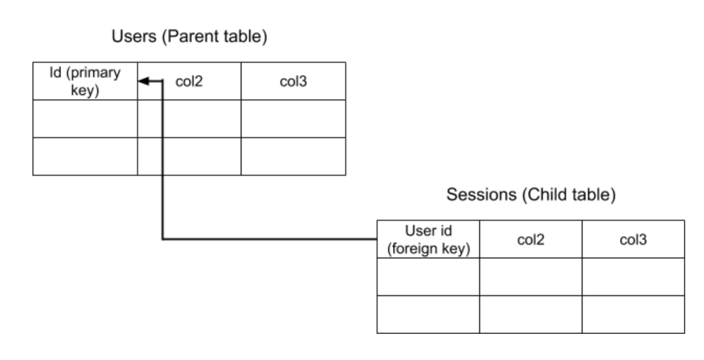

<p align="left">

  <i>An open source project from Data to AI Lab at MIT.</i>
</p>


[![][pypi-img]][pypi-url] [![][travis-img]][travis-url]

# SDV - Synthetic Data Vault


Automated generative modeling and sampling

- Free software: MIT license
- Documentation: https://HDI-Project.github.io/sdv

[travis-img]: https://travis-ci.org/HDI-Project/sdv.svg?branch=master
[travis-url]: https://travis-ci.org/HDI-Project/sdv
[pypi-img]: https://img.shields.io/pypi/v/sdv.svg
[pypi-url]: https://pypi.python.org/pypi/sdv

## Summary
The goal of the Synthetic Data Vault (SDV) is to allow data scientists to navigate, model, and sample relational databases. The library is divided into three core classes: the DataNavigator, the Modeler and the Sampler. Using these classes, users can get easy access to information about the relational database, create generative models for tables in the database and sample rows from these models to produce synthetic data.

The overall flow of SDV is as follows: the DataNavigator extracts relevant information from the dataset, as well as applies desired transformations. This class is then passed into a Modeler, which uses the information in the DataNavigator to create generative models of the tables. Finally, a Modeler can be given to a Sampler to actual sample rows of synthetic data.

## Setup/Installation
### Using a virtual environment
Although not necessary, a virtual environment makes it simpler to install and run the code in SDV.
Example using Conda:
```bash
$ conda create -n sdv_env python=3.6
```
To activate the environment use
```bash
$ conda activate sdv_demo
```
To deactivate the environment use
```bash
$ conda deactivate
```
### Installing requirements using pip
The easiest way to install all of the requirements for SDV is to use pip.
```bash
$ pip install -r requirements.txt
```
### Quick Usage
If you don't have data and a meta.json file to use, but would still like to test out SDV, you can use the following command to download demo files from an Airbnb dataset:
```bash
$ python demo_data_downloader.py
```
This will create a folder called "demo", in the root of this project. In that folder will be three different files. There will be two CSV files, one called "sessions_demo.csv" and another called "users_demo.csv". There will also be a meta.json file for this data called "Airbnb_demo_meta.json".

### Using the DataNavigator
The DataNavigator can be used to extract useful information about a dataset, such as the relationships between tables. It can also be used to apply transformations. Here we will use it to load the Airbnb data from the CSV files and apply some transformations to it.

First, we will create an instance of a DataLoader class. There are different types of DataLoaders, but since the Airbnb data is stored in CSV files, we will use the CSVDataLoader class.
```bash
>>> from sdv.DataNavigator import *
```

To create an instance of the class, the filepath to the meta.json file must be provided.
```bash
>>> data_loader = CSVDataLoader('demo/Airbnb_demo_meta.json')
```

The load_data() function can then be used to create an instance of a DataNavigator.
```bash
>>> data_navigator = data_loader.load_data()
```

The DataNavigator stores the data as a dictionary mapping the table names to a tuple of the data itself (represented as a pandas dataframe) and the meta information for that table. You can access the data using the following command:
```bash
>>> data = data_navigator.get_data()
>>> users_data = data['users'][0]
>>> print(users_data)
id date_account_created  timestamp_first_active  \
0    d1mm9tcy42           2014-01-01          20140101000936   
1    yo8nz8bqcq           2014-01-01          20140101001558   
2    4grx6yxeby           2014-01-01          20140101001639   
3    ncf87guaf0           2014-01-01          20140101002146   
4    4rvqpxoh3h           2014-01-01          20140101002619   
5    c8mfesvkv0           2014-01-01          20140101002626   
6    xwxei6hdk4           2014-01-01          20140101002742   
7    5f45ro5uzk           2014-01-01          20140101003535   
8    ro2stddszp           2014-01-01          20140101005503
...

>>> users_meta = data['users'][1]
>>> print(users_meta)
{'path': 'users_demo.csv', 'name': 'users', 'use': True, 'headers': True, 'fields': {'id': {'name': 'id', 'type': 'id', 'regex': '^.{10}$', 'uniques': 213451}, 'date_account_created': {'name': 'date_account_created', 'type': 'datetime', 'format': '%Y-%m-%d', 'uniques': 1634}, 'timestamp_first_active': {'name': 'timestamp_first_active', 'type': 'datetime', 'format': '%Y%m%d%H%M%S', 'uniques': 213451}, 'date_first_booking': {'name': 'date_first_booking', 'type': 'datetime', 'format': '%Y-%m-%d', 'uniques': 1977}, 'gender': {'name': 'gender', 'type': 'categorical', 'subtype': 'categorical', 'uniques': 4}, 'age': {'name': 'age', 'type': 'number', 'subtype': 'integer', 'uniques': 128}, 'signup_method': {'name': 'signup_method', 'type': 'categorical', 'subtype': 'categorical', 'uniques': 3}, 'signup_flow': {'name': 'signup_flow', 'type': 'categorical', 'subtype': 'categorical', 'uniques': 17}, 'language': {'name': 'language', 'type': 'categorical', 'subtype': 'categorical', 'uniques': 25}, 'affiliate_channel': {'name': 'affiliate_channel', 'type': 'categorical', 'subtype': 'categorical', 'uniques': 8}, 'affiliate_provider': {'name': 'affiliate_provider', 'type': 'categorical', 'subtype': 'categorical', 'uniques': 18}, 'first_affiliate_tracked': {'name': 'first_affiliate_tracked', 'type': 'categorical', 'subtype': 'categorical', 'uniques': 8}, 'signup_app': {'name': 'signup_app', 'type': 'categorical', 'subtype': 'categorical', 'uniques': 4}, 'first_device_type': {'name': 'first_device_type', 'type': 'categorical', 'subtype': 'categorical', 'uniques': 9}, 'first_browser': {'name': 'first_browser', 'type': 'categorical', 'subtype': 'categorical', 'uniques': 52}}, 'primary_key': 'id', 'number_of_rows': 213451}
```

You can also use the data navigator to get parents or children of a table.
```bash
>>> data_navigator.get_parents('sessions')
{'users'}

>>> data_navigator.get_children('users')
{'sessions'}
```
Finally, we can use the transform_data() function to apply transformations from the [RDT library](https://github.com/HDI-Project/rdt) to our data. If no transformations are provided, the function will convert all categorical types and datetime types to numeric values by default. It will return a dictionary mapping the table name to the transformed data represented as a pandas dataframe.
```bash
>>> data_navigator.transform_data()
{'users':      date_account_created  timestamp_first_active  date_first_booking  \
0            1.388552e+18            1.388553e+18        1.388812e+18   
1            1.388552e+18            1.388553e+18                 NaN   
2            1.388552e+18            1.388553e+18                 NaN   
3            1.388552e+18            1.388554e+18                 NaN   
4            1.388552e+18            1.388554e+18        1.388639e+18   
5            1.388552e+18            1.388554e+18                 NaN   
6            1.388552e+18            1.388554e+18        1.389071e+18   
7            1.388552e+18            1.388555e+18                 NaN   
...
```

### Using the Modeler
The Modeler can be used to recursively model the data. This is important because the tables in the data have relationships between them, that should also be modeled in order to have reliable sampling. Let's look at the Airbnb data for example. There are two tables in this data set: the users tables and the sessions table. A hierarchical graph of the dataset is shown below.

As shown above, the sessions table has a field labelled "user_id", that references the "id" field of the user table. SDV wants to model not only the data, but these relationships as well. The Modeler class is responsible for carrying out this task.

Let's do an example with the Airbnb data. First, import from the Modeler and create an instance of the class. The Modeler must be provided the DataNavigator and the type of model to use. If no model type is provided, it will use a [Gaussian Copula](https://github.com/DAI-Lab/copulas) by default. Note that in order for the modeler to work, the DataNavigator must have already transformed its data.
```bash
>>> from sdv.Modeler import Modeler
>>> modeler = Modeler(data_navigator)
```
Then you can model the entire database. The modeler will store models for every table in the dataset.
```bash
>>> modeler.model_database()
```
The models that were created for each table can be accessed using the following command:
```bash
>>> users_model = modeler.models['users']
>>> print(users_model)
0
==============
Distribution Type: Gaussian
Variable name: 0
Mean: 1.0990408683505088
Standard deviation: 0.17671580552794433
Max: 2.000000000000001
Min: 1.001908396946565

1
==============
Distribution Type: Gaussian
Variable name: 1
Mean: 0.38030564820703033
Standard deviation: 0.45647005172100924
Max: 2.0000000000000004
Min: -1.9999999999999996

2
==============
Distribution Type: Gaussian
Variable name: 2
Mean: 0.6268105844505327
Standard deviation: 0.4681150315536561
Max: 2.0000000000000004
Min: -1.9999999999999998
...
```
The output above shows the parameters that got stored for every column in the users table.

The modeler can also be saved to a file using the save_model() function. This will save a pkl file to a folder labelled "models", in the sdv folder. The desired name for the file must be provided.
```bash
>>> modeler.save_model('demo_model')
```
If you have stored a model in a previous session using the command above, you can load the model using the following command:
```bash
>>> from sdv.utils import load_model
>>> modeler = load_model('sdv/models/demo_model.pkl')
```
### Using the Sampler
The Sampler takes in a Modeler and DataNavigator. Using the mdels created in the last step, the Sampler can recursively move through the tables in the dataset, and sample synthetic data. It can be used to sample rows from specified tables, sample an entire table at once or sample the whole database.

Let's do an example with the Airbnb data. First import the Sampler and create an instance of the class.
```bash
>>> from sdv.Sampler import Sampler
>>> sampler = Sampler(data_navigator, modeler)
```

To sample from a row, use the command below. Note that before sampling from a child table, one of its parent tables must be sampled from.
```bash
>>> sampler.sample_rows('users', 1)
0           2014-01-02         20140102175145         2014-01-30  -unknown-   

   age signup_method  signup_flow language affiliate_channel  \
0   20         basic            0       en            direct   

  affiliate_provider first_affiliate_tracked signup_app first_device_type  \
0             google                     omg        Web       Mac Desktop   

   first_browser  
0  Mobile Safari
```

To sample a whole table use sample_table. This will create as many rows as in the original database.
```bash
>>> sampler.sample_table('users')
date_account_created timestamp_first_active date_first_booking     gender  \
0             2014-01-04         20140104172305         2014-01-09       MALE   
1             2014-01-01         20140101145313         2014-04-18  -unknown-   
2             2014-01-01         20140101233803         2013-12-23       MALE   
3             2014-01-02         20140102173933         2014-03-23  -unknown-   
4             2014-01-03         20140104071157         2014-01-31  -unknown-   
5             2013-12-31         20131231224951         2013-12-09  -unknown-   
6             2014-01-05         20140105205012         2014-05-01  -unknown-  
...
```

Finally, the entire database can be sampled using sample_all(num_rows). The num_rows parameter specifies how many child rows to create per parent row. This function returns a dictionary mapping table names to the generated dataframes.

```bash
>>> sampler.sample_all()
{'users':   date_account_created timestamp_first_active date_first_booking     gender  \
0           2014-01-01         20140102081228         2014-02-12  -unknown-   

   age signup_method  signup_flow language affiliate_channel  \
0   60         basic            0       en         sem-brand   

  affiliate_provider first_affiliate_tracked signup_app first_device_type  \
0             direct               untracked        Web       Mac Desktop   

  first_browser  
0        Safari  , 'sessions':           action  action_type  action_detail      device_type  \
0         create          NaN            NaN  Windows Desktop   
1         search          NaN            NaN  Windows Desktop   
2  confirm_email          NaN            NaN  Windows Desktop   
3           edit          NaN            NaN  Windows Desktop   
4   authenticate          NaN            NaN  Windows Desktop   

          secs_elapsed  
0  9223372036854775807  
1  9223372036854775807  
2  9223372036854775807  
3  9223372036854775807  
4  9223372036854775807  }
```
