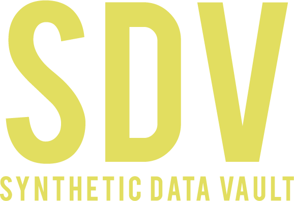

<p align="left">
  <a href="https://dai.lids.mit.edu">
    
  </a>
  <i>An Open Source Project from the <a href="https://dai.lids.mit.edu">Data to AI Lab, at MIT</a></i>
</p>

[](https://pypi.org/search/?c=Development+Status+%3A%3A+2+-+Pre-Alpha)
[](https://pypi.python.org/pypi/SDV)
[](https://github.com/sdv-dev/SDV/actions?query=workflow%3A%22Run+Tests%22+branch%3Amaster)
[](https://codecov.io/gh/sdv-dev/SDV)
[](https://pepy.tech/project/sdv)
[](https://mybinder.org/v2/gh/sdv-dev/SDV/master?filepath=tutorials)
[](https://join.slack.com/t/sdv-space/shared_invite/zt-gdsfcb5w-0QQpFMVoyB2Yd6SRiMplcw)



* Website: https://sdv.dev
* Documentation: https://sdv.dev/SDV
    * [User Guides](https://sdv.dev/SDV/user_guides/index.html)
    * [Developer Guides](https://sdv.dev/SDV/developer_guides/index.html)
* Github: https://github.com/sdv-dev/SDV
* License: [MIT](https://github.com/sdv-dev/SDV/blob/master/LICENSE)
* Development Status: [Pre-Alpha](https://pypi.org/search/?c=Development+Status+%3A%3A+2+-+Pre-Alpha)

## Overview

The **Synthetic Data Vault (SDV)** is a **Synthetic Data Generation** ecosystem of libraries
that allows users to easily learn [single-table](
https://sdv.dev/SDV/user_guides/single_table/index.html), [multi-table](
https://sdv.dev/SDV/user_guides/relational/index.html) and [timeseries](
https://sdv.dev/SDV/user_guides/timeseries/index.html) datasets to later on generate new
**Synthetic Data** that has the **same format and statistical properties** as the original dataset.

Synthetic data can then be used to supplement, augment and in some cases replace real data when
training Machine Learning models. Additionally, it enables the testing of Machine Learning or
other data dependent software systems without the risk of exposure that comes with data
disclosure.

Underneath the hood it uses several probabilistic graphical modeling and deep learning based
techniques. To enable a variety of data storage structures, we employ unique
hierarchical generative modeling and recursive sampling techniques.

### Current functionality and features:

* Synthetic data generators for [single tables](
  https://sdv.dev/SDV/user_guides/single_table/index.html) with the following
  features:
    * Using [Copulas](https://sdv.dev/SDV/user_guides/single_table/gaussian_copula.html)
      and [Deep Learning](https://sdv.dev/SDV/user_guides/single_table/ctgan.html)
      based models.
    * Handling of multiple data types and missing data with minimum user input.
    * Support for [pre-defined and custom constraints](
      https://sdv.dev/SDV/user_guides/single_table/constraints.html) and data validation.
* Synthetic data generators for [complex multi-table, relational datasets](
  https://sdv.dev/SDV/user_guides/relational/index.html) with the following
  features:
    * Definition of entire [multi-table datasets metadata](
      https://sdv.dev/SDV/user_guides/relational/relational_metadata.html) with a custom and
      flexible [JSON schema](https://sdv.dev/SDV/developer_guides/sdv/metadata.html).
    * Using Copulas and recursive modeling techniques.
* Synthetic data generators for [multi-type, multi-variate timeseries](
  https://sdv.dev/SDV/user_guides/timeseries/index.html) with the following features:
    * Using statistical, Autoregressive and Deep Learning models.
    * Conditional sampling based on contextual attributes.

## Try it out now!

If you want to quickly discover **SDV**, simply click the button below and follow the tutorials!

[](https://mybinder.org/v2/gh/sdv-dev/SDV/master?filepath=tutorials)

## Join our Slack Workspace

If you want to be part of the SDV community to receive announcements of the latest releases,
ask questions, suggest new features or participate in the development meetings, please join
our Slack Workspace!

[](https://join.slack.com/t/sdv-space/shared_invite/zt-gdsfcb5w-0QQpFMVoyB2Yd6SRiMplcw)

# Install

**Using `pip`:**

```bash
pip install sdv
```

**Using `conda`:**

```bash
conda install -c sdv-dev -c conda-forge sdv
```

For more installation options please visit the [SDV installation Guide](
https://sdv.dev/SDV/getting_started/install.html)

# Quickstart

In this short tutorial we will guide you through a series of steps that will help you
getting started using **SDV**.

## 1. Model the dataset using SDV

To model a multi table, relational dataset, we follow two steps. In the first step, we will load
the data and configures the meta data. In the second step, we will use the sdv API to fit and
save a hierarchical model. We will cover these two steps in this section using an example dataset.

### Step 1: Load example data

**SDV** comes with a toy dataset to play with, which can be loaded using the `sdv.load_demo`
function:

```python3
from sdv import load_demo

metadata, tables = load_demo(metadata=True)
```

This will return two objects:

1. A `Metadata` object with all the information that **SDV** needs to know about the dataset.

For more details about how to build the `Metadata` for your own dataset, please refer to the
[Working with Metadata](https://sdv.dev/SDV/user_guides/relational/relational_metadata.html)
tutorial.

2. A dictionary containing three `pandas.DataFrames` with the tables described in the
metadata object.

The returned objects contain the following information:

```
{
    'users':
            user_id country gender  age
          0        0     USA      M   34
          1        1      UK      F   23
          2        2      ES   None   44
          3        3      UK      M   22
          4        4     USA      F   54
          5        5      DE      M   57
          6        6      BG      F   45
          7        7      ES   None   41
          8        8      FR      F   23
          9        9      UK   None   30,
  'sessions':
          session_id  user_id  device       os
          0           0        0  mobile  android
          1           1        1  tablet      ios
          2           2        1  tablet  android
          3           3        2  mobile  android
          4           4        4  mobile      ios
          5           5        5  mobile  android
          6           6        6  mobile      ios
          7           7        6  tablet      ios
          8           8        6  mobile      ios
          9           9        8  tablet      ios,
  'transactions':
          transaction_id  session_id           timestamp  amount  approved
          0               0           0 2019-01-01 12:34:32   100.0      True
          1               1           0 2019-01-01 12:42:21    55.3      True
          2               2           1 2019-01-07 17:23:11    79.5      True
          3               3           3 2019-01-10 11:08:57   112.1     False
          4               4           5 2019-01-10 21:54:08   110.0     False
          5               5           5 2019-01-11 11:21:20    76.3      True
          6               6           7 2019-01-22 14:44:10    89.5      True
          7               7           8 2019-01-23 10:14:09   132.1     False
          8               8           9 2019-01-27 16:09:17    68.0      True
          9               9           9 2019-01-29 12:10:48    99.9      True
}
```

### 2. Fit a model using the SDV API.

First, we build a hierarchical statistical model of the data using **SDV**. For this we will
create an instance of the `sdv.SDV` class and use its `fit` method.

During this process, **SDV** will traverse across all the tables in your dataset following the
primary key-foreign key relationships and learn the probability distributions of the values in
the columns.

```python3
from sdv import SDV

sdv = SDV()
sdv.fit(metadata, tables)
```

Once the modeling has finished, you can save your fitted `SDV` instance for later usage
using the `save` method of your instance.

```python3
sdv.save('sdv.pkl')
```

The generated `pkl` file will not include any of the original data in it, so it can be
safely sent to where the synthetic data will be generated without any privacy concerns.

## 2. Sample data from the fitted model

In order to sample data from the fitted model, we will first need to load it from its
`pkl` file. Note that you can skip this step if you are running all the steps sequentially
within the same python session.

```python3
sdv = SDV.load('sdv.pkl')
```

After loading the instance, we can sample synthetic data by calling its `sample` method.

```python3
samples = sdv.sample()
```

The output will be a dictionary with the same structure as the original `tables` dict,
but filled with synthetic data instead of the real one.

Finally, if you want to evaluate how similar the sampled tables are to the real data,
please have a look at our [evaluation](EVALUATION.md) framework or visit the [SDMetrics](
https://github.com/sdv-dev/SDMetrics) library.

# Join our community

1. If you would like to see more usage examples, please have a look at the [tutorials folder](
   https://github.com/sdv-dev/SDV/tree/master/tutorials) of the repository. Please contact us
   if you have a usage example that you would want to share with the community.
2. Please have a look at the [Contributing Guide](https://sdv.dev/SDV/developer_guides/contributing.html)
   to see how you can contribute to the project.
3. If you have any doubts, feature requests or detect an error, please [open an issue on github](
   https://github.com/sdv-dev/SDV/issues) or [join our Slack Workspace](
   https://join.slack.com/t/sdv-space/shared_invite/zt-gdsfcb5w-0QQpFMVoyB2Yd6SRiMplcw)
4. Also, do not forget to check the [project documentation site](https://sdv.dev/SDV/)!

# Citation

If you use **SDV** for your research, please consider citing the following paper:

Neha Patki, Roy Wedge, Kalyan Veeramachaneni. [The Synthetic Data Vault](https://dai.lids.mit.edu/wp-content/uploads/2018/03/SDV.pdf). [IEEE DSAA 2016](https://ieeexplore.ieee.org/document/7796926).

```
@inproceedings{
    7796926,
    author={N. {Patki} and R. {Wedge} and K. {Veeramachaneni}},
    booktitle={2016 IEEE International Conference on Data Science and Advanced Analytics (DSAA)},
    title={The Synthetic Data Vault},
    year={2016},
    volume={},
    number={},
    pages={399-410},
    keywords={data analysis;relational databases;synthetic data vault;SDV;generative model;relational database;multivariate modelling;predictive model;data analysis;data science;Data models;Databases;Computational modeling;Predictive models;Hidden Markov models;Numerical models;Synthetic data generation;crowd sourcing;data science;predictive modeling},
    doi={10.1109/DSAA.2016.49},
    ISSN={},
    month={Oct}
}
```
